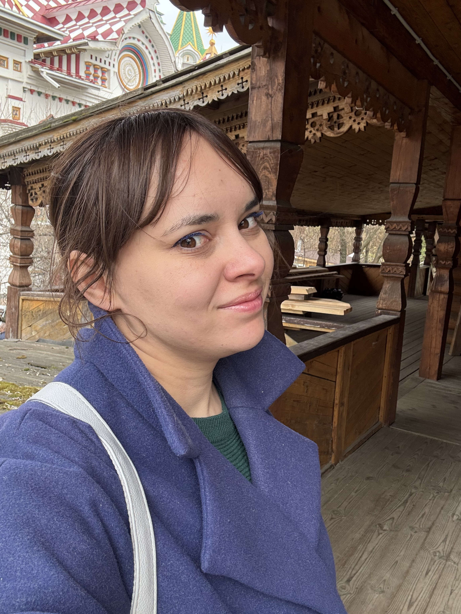

# Глушак Наталья Олеговна

**Системный аналитик** | Москва | Гибридный/удаленный формат

---

### Контактная информация
*   **Телефон:** +7 (914) 386-01-47 (Telegram)
*   **Telegram:** [@taknata](https://t.me/taknata)
*   **Email:** [pohodeiko_nataly@mail.ru](mailto:pohodeiko_nataly@mail.ru)
*   **GitHub:** https://github.com/natalyFei
*   **Проживание:** Москва, гражданство РФ
*   **Предпочитаемый способ связи:** Telegram

---

### Опыт работы

#### **Основатель и специалист студии видео-поздравлений** (Фриланс/ИП)
Февраль 2018 — Декабрь 2025 (7 лет)

*   **Управление и анализ:** Создала и развила бизнес с нуля, выполняя функции менеджера проектов, видеомонтажера и технического специалиста.
*   **Ключевое достижение (системный анализ):**
    *   Провела анализ бизнес-процессов и воронки продаж.
    *   Активно участвовала в **проектировании и создании системы** для автоматизации привлечения клиентов и учета заказов.
    *   **Технологический стек проекта:** ZennoPoster (автоматизация), AmoCRM (CRM-система), API социальных сетей (VK, OK), PostgreSQL (база данных).
*   **Работа с клиентами:** Полный цикл сопровождения — от переговоров и сбора требований до финальной реализации.
*   **Технологический стек:** Постоянное изучение и внедрение новых инструментов, включая **нейросети для обработки контента** и изучение **Python** для автоматизации сложных задач.

#### **Ведущий программист**
ГАУ «Многофункциональный центр предоставления государственных и муниципальных услуг Амурской области»
`Ноябрь 2012 — Март 2017` (4 года 5 месяцев)

*   **Внедрение и сопровождение АИС:** Полный цикл внедрения новой АИС «Капелла» (тестирование, опытная и промышленная эксплуатация) в 23 МФЦ с заменой устаревшей системы.
*   **Интеграция:** Организация взаимодействия с внешними системами (**СМЭВ, ЕСИА, ГИС ГМП**).
*   **Документирование и compliance:**
    *   Подготовка полного пакета документов для **аттестации ИСПДн** (152-ФЗ).
    *   Работа с НПА (210-ФЗ, 152-ФЗ), разработка регламентов, инструкций и технической документации.
    *   Ведение отчетности на `bus.gov.ru` и `zakupki.gov.ru`.
*   **Взаимодействие:** Координация с разработчиками, согласование ТЗ, работа с поставщиками ПО и оборудования, обучение сотрудников, техническая поддержка.

#### **Ведущий специалист**
Управление ЕМИС, Администрация г. Благовещенска
`Август 2012 — Октябрь 2012` (3 месяца)

*   Администрирование СЭД «Дело+».
*   Техническая поддержка и консультирование пользователей.
*   Работа в системах «АЦК-закупки» и «РГУ».

---

### 🎯 Актуальное обучение (в процессе)

*   **Курс «Профессия: Системный аналитик»** (`2025 — настоящее время`)
    *    https://stepik.org/
    *   **Осваиваемые компетенции:**
    *   **Проектирование интеграций:** разработка спецификаций для REST, gRPC, GraphQL API (OpenAPI/Swagger) и асинхронных сервисов (AsyncAPI).
    *   **Моделирование данных и архитектуры:** создание ERD-диаграмм, написание SQL, описание систем с использованием методологий C4 и PlantUML.
    *   **Работа с требованиями:** полный цикл от выявления до документирования (подход Doc-as-a-Code).
    *   **Автоматизация задач:** применение ИИ для генерации артефактов и Git для управления версиями.
    *   **Основы System Design & DevOps:** понимание микросервисной архитектуры, CI/CD и контейнеризации.

---
### Навыки (Skills)

| Категория         | Навыки                                                                                                                                         |
| ----------------- | ---------------------------------------------------------------------------------------------------------------------------------------------- |
| **Аналитические** | Системный анализ, сбор и анализ требований, аналитическое мышление, проектирование процессов, разработка ТЗ/ТП, моделирование бизнес-процессов |
| **Технические**   | SQL (опыт с PostgreSQL), Python (изучение, базовый уровень), Git, API (практический опыт интеграции)                                           |
| **Предметные**    | Понимание жизненного цикла ПО, интеграция, compliance (152-ФЗ, 210-ФЗ), опыт внедрения CRM (AmoCRM)                                            |
| **Управление**    | Управление проектами (от идеи до реализации), тайм-менеджмент, работа с клиентами, обучение персонала                                          |
| **Инструменты**   | AmoCRM, ZennoPoster, СМЭВ/ЕСИА, СЭД «Дело+», 1С (курсы)                                                                                        |
| **Языки**         | Русский (родной), Английский (A2), Китайский (A2, увлечение культурой)                                                                         |
|                   |                                                                                                                                                |

---

### Образование и сертификации

*   **Высшее образование**
    `2007 — 2012`
    **Благовещенский государственный педагогический университет**
    Физико-математический факультет, специальность «Информационные системы и технологии»

*   **Повышение квалификации**
    `2016` — **«Обеспечение безопасности персональных данных...»**, НОУ ДПО «Институт «АйТи»
    `2012` — **«Автоматизация учета с использованием 1С:Предприятие»**, Московская академия предпринимательства

---

### Обо мне

Целеустремленный специалист с опытом создания бизнеса с нуля, стремящийся реализовать себя в **системном анализе**. Обладаю сильными **коммуникативными навыками**, умением анализировать процессы и предлагать решения для их оптимизации и автоматизации. Нахожусь в постоянном профессиональном развитии (изучение Python, эксперименты с нейросетями). Ищу командную роль, где смогу принести пользу, улучшая IT-продукты через глубокий анализ и четкую постановку задач.

**Качества:** Ответственность, быстрая обучаемость, нацеленность на результат.
**Хобби:** Изучение китайского языка и каллиграфии (имеется опыт полугодовой учебы в Китае).

**Готовность учиться и быстро осваивать новое** — это то, что мне всегда помогало в карьере.
